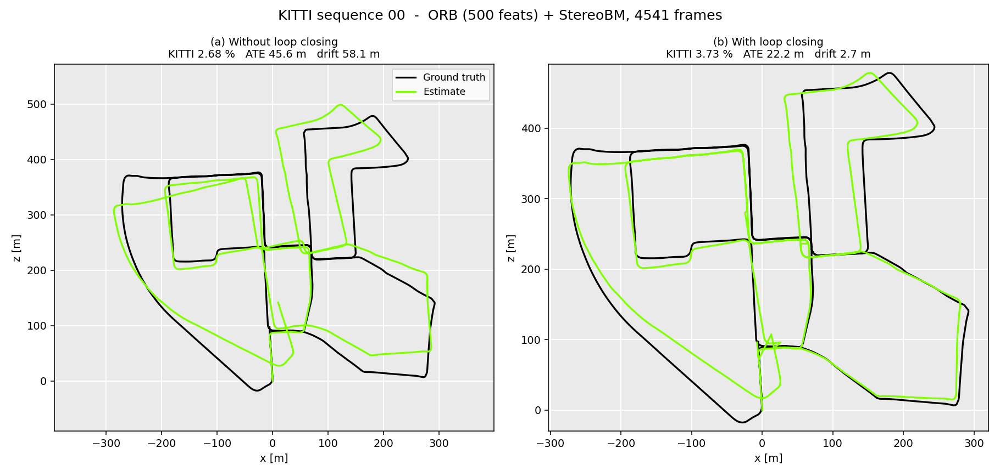
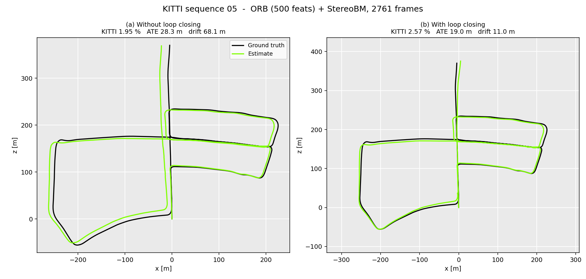
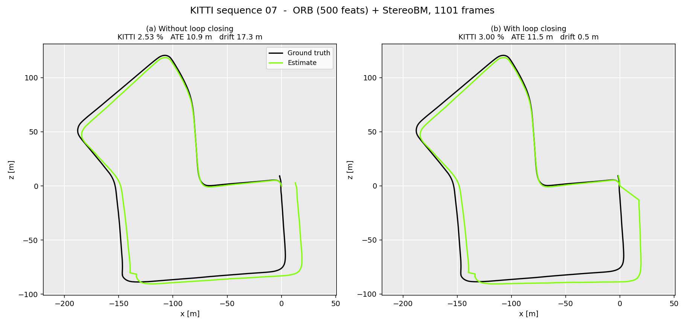

# Stereo Visual Odometry & SLAM on KITTI

A stereo visual odometry pipeline with appearance-based loop closure, built on
OpenCV primitives and evaluated on the
[KITTI odometry benchmark](https://www.cvlibs.net/datasets/kitti/eval_odometry.php).
No SLAM framework, no ROS — the geometry is written out so the pipeline can be
read end to end.



*KITTI sequence 00, 4541 frames, StereoBM + ORB. Loop closing cuts absolute
trajectory error from 45.56 m to 22.22 m over 3.7 km, and final drift from
58.13 m to 2.70 m. Ground truth in black, estimate in green.*

## Attribution

**The stereo visual odometry base of this project is derived from
[FoamoftheSea/KITTI_visual_odometry](https://github.com/FoamoftheSea/KITTI_visual_odometry)
by Nate Cibik** ("KITTI Odometry in Python and OpenCV — Beginner's Guide to Computer
Vision"), which is licensed under GPL-3.0. I worked through that tutorial to learn the
geometry, and the dataset handling, disparity/depth computation, feature matching and
PnP motion-estimation stages follow its structure. This repository is therefore also
released under **GPL-3.0** (see [LICENSE](LICENSE)); credit for the underlying tutorial
belongs to its author.

What I added on top of it:

| Component | Origin |
|---|---|
| Dataset loading, disparity/depth, feature matching, PnP odometry | Derived from the tutorial above (refactored, vectorised, bugs fixed) |
| **Keyframe database and loop detection** (`loop_closure.py`) | Mine |
| **Loop-closure vs pure-odometry comparison** | Mine |
| **Evaluation harness** — KITTI segment error, ATE, RPE, Umeyama alignment (`metrics.py`) | Mine |
| **Test suite** — analytic metric tests + synthetic end-to-end smoke test (`tests/`) | Mine |
| Package structure, CLI, plotting | Mine |

Refactoring in this version includes vectorising the 3D back-projection loop, fixing
the streamed-loading path (it was reading right images from `image_0` and taking the
image height from a pixel row), replacing hardcoded absolute paths with `$KITTI_ROOT`,
and replacing a single-reference-frame error function with standard trajectory metrics.

## Pipeline

```
stereo pair ──► disparity (StereoBM / StereoSGBM)
                    │
                    ▼
              depth  Z = f·b/d ──────────┐
                                         │
left frame t ──► detect + describe ──┐   │
left frame t+1 ─► detect + describe ─┴─► k-NN match + Lowe ratio test
                                         │
                                         ▼
                            back-project matches to 3D (frame t)
                                         │
                                         ▼
                            solvePnPRansac  ──►  R, t
                                         │
                                         ▼
                       T_world ← T_world · T⁻¹   (pose accumulation)
                                         │
                                         ▼
                       keyframe database ──► loop detection
```

**Why 3D-2D PnP and not the essential matrix.** Decomposing E from a monocular
pair recovers rotation and the *direction* of translation, but not its magnitude.
Anchoring one side of the correspondence in stereo depth keeps metric scale, which
is the whole reason for using a stereo rig.

**Depth gating.** Where the stereo match fails, disparity collapses toward zero and
`Z = f·b/d` explodes. Those pixels are excluded above `max_depth` (3000) before
PnP, along with the left `numDisparities` columns of the image, where no disparity
can be computed at all. Without this the pose estimate is dominated by garbage 3D
points.

## Results

Sequences 00, 05 and 07, full length, ORB (500 features) + StereoBM, Lowe ratio
0.5, brute-force matching. Reproduce with the two commands below.

| Seq | Frames | Configuration | KITTI trans. | KITTI rot. | ATE RMSE | Final drift | RPE₁ trans. | fps |
|---|---|---|---|---|---|---|---|---|
| 00 | 4541 | VO only | **2.68 %** | 0.01075 deg/m | 45.56 m | 58.13 m | **0.070 m** | 20.9 |
| 00 | 4541 | VO + loop closure | 3.73 % | 0.01217 deg/m | **22.22 m** | **2.70 m** | 0.859 m | 25.3 |
| 05 | 2761 | VO only | **1.95 %** | 0.01222 deg/m | 28.28 m | 68.15 m | **0.065 m** | 24.3 |
| 05 | 2761 | VO + loop closure | 2.57 % | 0.01554 deg/m | **18.97 m** | **11.03 m** | 0.730 m | 25.2 |
| 07 | 1101 | VO only | **2.53 %** | 0.00987 deg/m | **10.87 m** | 17.34 m | **0.096 m** | 28.4 |
| 07 | 1101 | VO + loop closure | 3.00 % | 0.01326 deg/m | 11.53 m | **0.48 m** | 0.694 m | 28.4 |

Path lengths are 3724 m (00), 2206 m (05) and 695 m (07). Loop closure builds 193,
117 and 48 keyframes and fires 17, 11 and 4 detections respectively, with a largest
position correction of 47.7 m. One frame on sequence 00 failed PnP and reused the
previous transform; every other frame in every configuration solved.

```bash
python run.py --sequence 00 05 07 --stereo-matcher bm --output results/
python run.py --sequence 00 05 07 --stereo-matcher bm --no-loop-closure --output results/
```




**Loop closure trades local accuracy for global consistency.** It roughly halves
ATE on sequence 00 (45.56 → 22.22 m) and cuts it by a third on 05
(28.28 → 18.97 m), and it collapses final drift everywhere — 58 m to 2.7 m on 00,
17 m to 0.5 m on 07. It also costs about one percentage point on the KITTI metric
and inflates single-frame RPE tenfold, because each correction is a discontinuity:
the pose is overwritten with the stored keyframe pose rather than the loop being
optimised. Sequence 07 is the case where the trade does not pay off in ATE terms
(10.87 → 11.53 m) — it is short, revisits its start only once, and has no long
accumulated drift for a closure to cancel.

The per-length breakdown of the KITTI metric shows the two failure modes cleanly
on sequence 00. Without loop closure, error grows with window length — 2.02 % at
100 m rising to 3.18 % at 800 m, the signature of accumulating drift. With it, the
shape inverts: 4.12 % at 100 m falling to 2.79 % at 800 m, because a single
discontinuity is a large fraction of a 100 m window and averages out over 800 m.

### Feature count is a loop-closure parameter

Loop detection fires on a fixed count of surviving descriptor matches
(`loop_threshold = 50`). That threshold is only meaningful relative to how many
features exist per frame, so `ORB_FEATURES` silently tunes the detector:

| ORB features | Detections on seq 00 | Largest correction | KITTI trans. | ATE RMSE |
|---|---|---|---|---|
| 500 | 17 | 47.7 m | 3.73 % | 22.22 m |
| 3000 | 37 | 208.9 m | 7.31 % | 32.61 m |

At 3000 features the same 50-match threshold is crossed by coincidence between
places that merely look alike, producing four false closures of roughly 200 m each
on sequence 00 and pushing the KITTI error to 7.31 %. The extra features genuinely
help the odometry — pure VO improves from 2.68 % to 2.33 % — so the fix is not to
avoid them but to scale the threshold with the descriptor count, or to score a
*fraction* of features matched rather than an absolute number. Until then,
`ORB_FEATURES` and `loop_threshold` have to be changed together.

An earlier version of this README quoted development numbers of 206.5 m with loop
closure against 215.4 m without, as mean Euclidean position error on sequence 00.
Those are obsolete: they predate the fix to the streamed loading path, which had
been reading right images from `image_0`, so the "stereo" depth was computed from
two copies of the left camera.


## Setup

```bash
git clone <this repo> && cd stereo-slam-kitti
pip install -r requirements.txt
```

Download the KITTI odometry grayscale images, calibration and ground-truth poses,
unpack them side by side, and point the code at the parent directory:

```
$KITTI_ROOT/
├── data_odometry_gray/dataset/sequences/00/image_0/*.png
├── data_odometry_gray/dataset/sequences/00/image_1/*.png
├── data_odometry_calib/dataset/sequences/00/calib.txt
└── data_odometry_poses/dataset/poses/00.txt
```

```bash
export KITTI_ROOT=/path/to/kitti      # or pass --data-root
python run.py --sequence 00 --detector orb --stereo-matcher sgbm
```

Useful flags: `--frames 300` for a quick run (pair it with shorter
`--lengths 10 20 50`), `--preload` to hold the sequence in RAM if you have the
memory, `--no-loop-closure` for the pure-odometry baseline.

## Metrics

`stereo_slam/metrics.py` implements the standard three:

* **KITTI odometry error** — relative pose error over 100–800 m sub-sequences,
  reported as translation error in % of distance travelled and rotation error in
  deg/m. Normalising by distance is what makes results comparable across
  sequences; a raw metre figure is not.
* **ATE** — RMSE of absolute position error, optionally after Umeyama alignment
  (`--align`). KITTI is metric and origin-anchored, so unaligned is the default.
* **RPE** — drift over a fixed frame gap, which separates per-frame accuracy from
  accumulated global drift.

All three are covered by unit tests against analytically known answers (a
trajectory scaled by 0.9 must report ≈10% translation error; a rigid offset must
inflate ATE but leave the relative metrics at zero).

## Limitations

Stated plainly, because they are the interesting part:

1. **No bundle adjustment.** Poses are chained frame to frame and never revisited,
   so every PnP error is permanent. A sliding-window BA over the last N keyframes
   is the single largest available accuracy win.
2. **Loop correction is a snap, not an optimisation.** On detection the current
   pose is overwritten with the stored keyframe pose — position *and orientation*.
   Detecting the same *place* does not mean the vehicle is in the same *pose*, so
   the correction is only as good as the assumption that the car is oriented the
   way it was last time. Every intermediate pose is left untouched, and the
   trajectory gains a discontinuity: single-frame RPE rises roughly tenfold
   (0.070 → 0.859 m on sequence 00) while the odometry itself is unchanged.

   That discontinuity is also why *final drift* flatters this method. On sequence
   00 the last closure lands near the start point and final drift reads 2.70 m,
   while ATE says the trajectory is still 22 m off on average. Any single-endpoint
   measure will overstate how well loop closing is working.

   Two cheap mitigations before reaching for a pose graph: refuse to close while
   the vehicle is effectively stationary or rotating, and apply the correction as a
   relative transform rather than an absolute overwrite. The real answer is a pose
   graph that distributes the residual around the loop (g2o, GTSAM, Ceres).
3. **Place recognition is brute-force descriptor matching** against every keyframe
   — O(N) per query, and prone to false positives in repetitive scenes. Two
   consequences, both measured. The false positives are governed by the ratio
   between `loop_threshold` and `ORB_FEATURES`, not by either alone: see
   "Feature count is a loop-closure parameter" above. The cost grows with the
   database — the sweep stops early at the first similar keyframe, which keeps it
   affordable here (193 keyframes on sequence 00 at ~25 fps), but a query that
   finds nothing still compares against everything. DBoW2 or a learned global
   descriptor with a geometric verification step is the standard answer.
4. **Depth quality bounds everything.** StereoBM is fast but noisy on low-texture
   road surfaces; SGBM adds a semi-global smoothness cost and is cleaner, at
   roughly 25 % less throughput. The results above use StereoBM. Feature depth is
   sampled at a single pixel with no sub-pixel interpolation or local consistency
   check.
5. **No motion model or outlier rejection beyond RANSAC.** When PnP fails the
   previous transform is reused, which is a crude constant-velocity assumption.
   This fired exactly once across all six runs, on sequence 00; every other frame
   solved, so the fallback is close to untested on real data.
6. **Thresholds are absolute counts, not ratios.** `loop_threshold = 50` matches
   and `revisit_threshold = 5` are raw counts, so they are only meaningful at a
   particular `ORB_FEATURES`. Changing the feature count silently retunes the loop
   detector — the single most surprising behaviour in this codebase, and the reason
   the Results section documents both settings.


## Repository layout

```
stereo_slam/
├── dataset.py        KITTI sequence loading, calibration, ground-truth poses
├── stereo.py         disparity (BM/SGBM), depth, border masking
├── features.py       detection, description, k-NN matching, ratio test
├── odometry.py       3D back-projection and PnP+RANSAC motion estimation
├── loop_closure.py   keyframe database and loop detection
├── slam.py           the full per-frame loop
├── metrics.py        KITTI / ATE / RPE evaluation
└── plotting.py       trajectory and drift plots
run.py                CLI
notebooks/demo.ipynb  visual walkthrough of each stage
docs/                 trajectory plots used in this README
tests/                metric tests + synthetic end-to-end smoke test
```

```bash
pytest tests           # no KITTI download needed; the smoke test synthesises a sequence
```

## Roadmap

- [ ] Sliding-window bundle adjustment over keyframes
- [ ] Pose-graph optimisation on loop closure instead of pose snapping
- [ ] Bag-of-words place recognition with geometric verification
- [ ] Results across sequences 00–10 rather than a handful

## References

- Geiger, Lenz, Urtasun, *Are we ready for Autonomous Driving? The KITTI Vision
  Benchmark Suite*, CVPR 2012
- Scaramuzza & Fraundorfer, *Visual Odometry: Part I & II*, IEEE RA-M 2011/2012
- Mur-Artal, Montiel & Tardós, *ORB-SLAM*, IEEE T-RO 2015

## License

GPL-3.0 — see [LICENSE](LICENSE). This project is a derivative work of
[FoamoftheSea/KITTI_visual_odometry](https://github.com/FoamoftheSea/KITTI_visual_odometry)
(GPL-3.0), so it inherits that licence. See [Attribution](#attribution).
