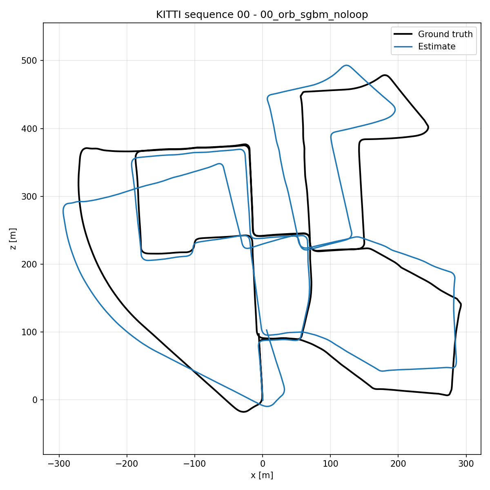
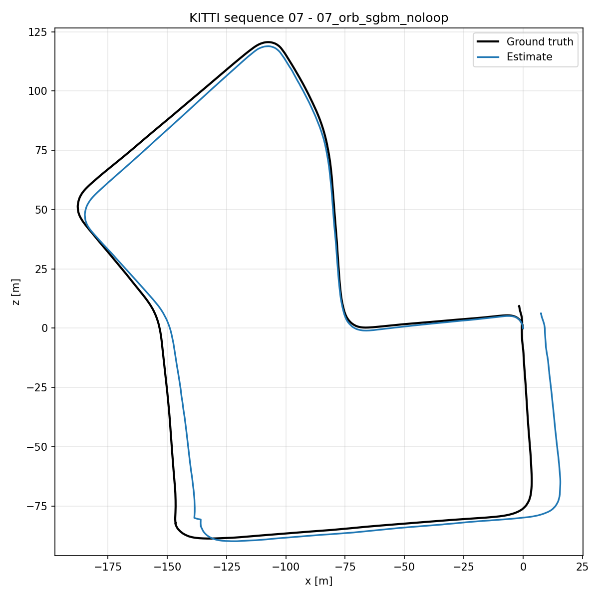
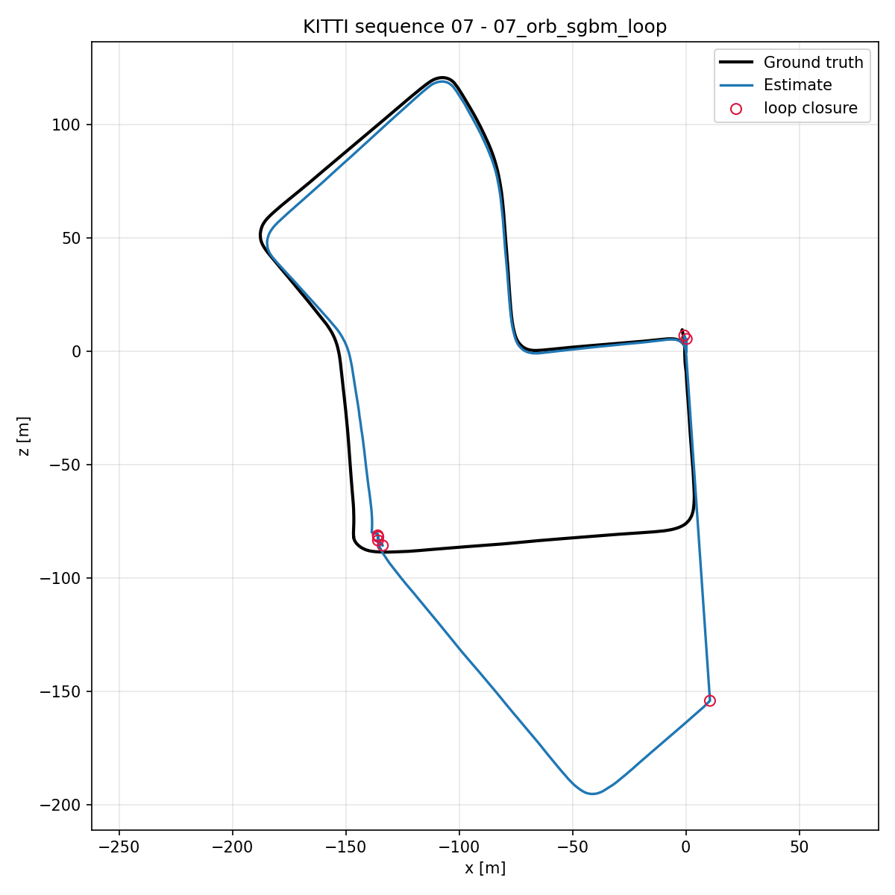

# Stereo Visual Odometry & SLAM on KITTI

A stereo visual odometry pipeline with appearance-based loop closure, built on
OpenCV primitives and evaluated on the
[KITTI odometry benchmark](https://www.cvlibs.net/datasets/kitti/eval_odometry.php).
No SLAM framework, no ROS — the geometry is written out so the pipeline can be
read end to end.



*KITTI sequence 00, 4541 frames, StereoSGBM + ORB, pure visual odometry — 2.21 %
KITTI translation error over 3.7 km, with no bundle adjustment and no loop
closure. Ground truth in black.*

## Attribution

**The stereo visual odometry base of this project is derived from
[FoamoftheSea/KITTI_visual_odometry](https://github.com/FoamoftheSea/KITTI_visual_odometry)
by Nate Cibik** ("KITTI Odometry in Python and OpenCV — Beginner's Guide to Computer
Vision"), which is licensed under GPL-3.0. I worked through that tutorial to learn the
geometry, and the dataset handling, disparity/depth computation, feature matching and
PnP motion-estimation stages follow its structure. This repository is therefore also
released under **GPL-3.0** (see [LICENSE](LICENSE)); credit for the underlying tutorial
belongs to its author.

What I added on top of it:

| Component | Origin |
|---|---|
| Dataset loading, disparity/depth, feature matching, PnP odometry | Derived from the tutorial above (refactored, vectorised, bugs fixed) |
| **Keyframe database and loop detection** (`loop_closure.py`) | Mine |
| **Loop-closure vs pure-odometry comparison** | Mine |
| **Evaluation harness** — KITTI segment error, ATE, RPE, Umeyama alignment (`metrics.py`) | Mine |
| **Test suite** — analytic metric tests + synthetic end-to-end smoke test (`tests/`) | Mine |
| Package structure, CLI, plotting | Mine |

Refactoring in this version includes vectorising the 3D back-projection loop, fixing
the streamed-loading path (it was reading right images from `image_0` and taking the
image height from a pixel row), replacing hardcoded absolute paths with `$KITTI_ROOT`,
and replacing a single-reference-frame error function with standard trajectory metrics.

## Pipeline

```
stereo pair ──► disparity (StereoBM / StereoSGBM)
                    │
                    ▼
              depth  Z = f·b/d ──────────┐
                                         │
left frame t ──► detect + describe ──┐   │
left frame t+1 ─► detect + describe ─┴─► k-NN match + Lowe ratio test
                                         │
                                         ▼
                            back-project matches to 3D (frame t)
                                         │
                                         ▼
                            solvePnPRansac  ──►  R, t
                                         │
                                         ▼
                       T_world ← T_world · T⁻¹   (pose accumulation)
                                         │
                                         ▼
                       keyframe database ──► loop detection
```

**Why 3D-2D PnP and not the essential matrix.** Decomposing E from a monocular
pair recovers rotation and the *direction* of translation, but not its magnitude.
Anchoring one side of the correspondence in stereo depth keeps metric scale, which
is the whole reason for using a stereo rig.

**Depth gating.** Where the stereo match fails, disparity collapses toward zero and
`Z = f·b/d` explodes. Those pixels are excluded above `max_depth` (3000) before
PnP, along with the left `numDisparities` columns of the image, where no disparity
can be computed at all. Without this the pose estimate is dominated by garbage 3D
points.

## Results

Sequences 00, 05 and 07, ORB features (3000 per frame), Lowe ratio 0.5,
brute-force Hamming matching. Every configuration completed with **zero failed
frames** — no frame ever fell back to the previous transform.

| Seq | Configuration | KITTI trans. | KITTI rot. | ATE RMSE | Final drift | RPE₁ trans. | fps |
|---|---|---|---|---|---|---|---|
| 00 | VO only (StereoBM) | 2.33 % | 0.00928 deg/m | 54.54 m | 45.98 m | 0.040 m | 19.4 |
| 00 | VO + loop closure (StereoBM) | 7.31 % | 0.03215 deg/m | 32.61 m | 4.42 m | 6.058 m | 4.2 |
| 00 | VO only (StereoSGBM) | **2.21 %** | 0.00902 deg/m | 46.71 m | 50.25 m | 0.039 m | 14.3 |
| 00 | VO + loop closure (StereoSGBM) | 6.83 % | 0.03113 deg/m | **30.77 m** | **4.44 m** | 6.068 m | 3.9 |
| 05 | VO only (StereoBM) | 1.54 % | 0.00651 deg/m | 17.26 m | 36.40 m | 0.035 m | 19.8 |
| 05 | VO + loop closure (StereoBM) | 3.07 % | 0.01375 deg/m | **7.32 m** | **12.38 m** | 0.713 m | 7.8 |
| 05 | VO only (StereoSGBM) | **1.53 %** | 0.00686 deg/m | 17.70 m | 38.41 m | 0.035 m | 14.4 |
| 05 | VO + loop closure (StereoSGBM) | 3.04 % | 0.01436 deg/m | 7.75 m | 14.54 m | 0.698 m | 6.8 |
| 07 | VO only (StereoBM) | 2.64 % | 0.01445 deg/m | 10.60 m | 21.37 m | 0.071 m | 18.7 |
| 07 | VO + loop closure (StereoBM) | 19.57 % | 0.12564 deg/m | 59.45 m | 7.34 m | 4.893 m | 11.3 |
| 07 | VO only (StereoSGBM) | **2.04 %** | 0.00929 deg/m | **8.15 m** | 11.57 m | 0.065 m | 14.0 |
| 07 | VO + loop closure (StereoSGBM) | 18.89 % | 0.12000 deg/m | 56.65 m | 7.34 m | 4.672 m | 9.1 |

Path lengths are 3724 m (00), 2206 m (05) and 695 m (07). Throughput is
single-threaded on a laptop CPU; `fps` includes disparity, detection, matching
and PnP.

```bash
python run.py --sequence 00 05 07 --stereo-matcher sgbm --output results/
python run.py --sequence 00 05 07 --stereo-matcher sgbm --no-loop-closure --output results/
```

**Reading the table.** Three things are worth pulling out.

*The odometry front end is the strong part.* 1.53–2.64 % translation error, frame
to frame, with no bundle adjustment and no windowed refinement. Single-frame
relative pose error stays at 3.5–7 cm.

*SGBM is better than BM, but by less than "visibly cleaner" suggests.* It wins on
07 (2.04 % vs 2.64 %) and modestly on 00 (2.21 % vs 2.33 %), and ties on 05
(1.53 % vs 1.54 %) — for roughly 25 % less throughput. Worth it when depth is the
bottleneck; not a free win.

*Loop closure trades local consistency for global anchoring, and the trade is not
always favourable.* Snapping to a stored keyframe pose improves ATE on 00
(46.71 → 30.77 m) and halves it on 05 (17.70 → 7.75 m), and improves final drift
on every sequence. It also degrades the KITTI metric on every sequence and
inflates single-frame RPE by one to two orders of magnitude (20× on 05, 155× on
00), because each correction is a discontinuity in the trajectory. On 07 it is
catastrophic (2.04 % → 18.89 %): a single snap fired while the vehicle was
stationary and turning, and the resulting heading error dominated the rest of the
run. Limitation 2 has the frame-by-frame breakdown.

That last point is the argument for reporting all three metric families rather
than one. Final drift alone says loop closure wins on all three sequences. An
earlier version of this README quoted development numbers of 206.5 m with loop
closure against 215.4 m without, measured as mean Euclidean position error over
sequence 00 — a single-endpoint-style figure that hid both the scale of the drift
and the discontinuities. Those numbers are obsolete. They also predate the fix to
the streamed loading path, which had been reading right images from `image_0` —
so the "stereo" depth was computed from two copies of the left camera, which
would account for errors of that size. The table above is what the pipeline
actually does.

## Setup

```bash
git clone <this repo> && cd stereo-slam-kitti
pip install -r requirements.txt
```

Download the KITTI odometry grayscale images, calibration and ground-truth poses,
unpack them side by side, and point the code at the parent directory:

```
$KITTI_ROOT/
├── data_odometry_gray/dataset/sequences/00/image_0/*.png
├── data_odometry_gray/dataset/sequences/00/image_1/*.png
├── data_odometry_calib/dataset/sequences/00/calib.txt
└── data_odometry_poses/dataset/poses/00.txt
```

```bash
export KITTI_ROOT=/path/to/kitti      # or pass --data-root
python run.py --sequence 00 --detector orb --stereo-matcher sgbm
```

Useful flags: `--frames 300` for a quick run (pair it with shorter
`--lengths 10 20 50`), `--preload` to hold the sequence in RAM if you have the
memory, `--no-loop-closure` for the pure-odometry baseline.

## Metrics

`stereo_slam/metrics.py` implements the standard three:

* **KITTI odometry error** — relative pose error over 100–800 m sub-sequences,
  reported as translation error in % of distance travelled and rotation error in
  deg/m. Normalising by distance is what makes results comparable across
  sequences; a raw metre figure is not.
* **ATE** — RMSE of absolute position error, optionally after Umeyama alignment
  (`--align`). KITTI is metric and origin-anchored, so unaligned is the default.
* **RPE** — drift over a fixed frame gap, which separates per-frame accuracy from
  accumulated global drift.

All three are covered by unit tests against analytically known answers (a
trajectory scaled by 0.9 must report ≈10% translation error; a rigid offset must
inflate ATE but leave the relative metrics at zero).

## Limitations

Stated plainly, because they are the interesting part:

1. **No bundle adjustment.** Poses are chained frame to frame and never revisited,
   so every PnP error is permanent. A sliding-window BA over the last N keyframes
   is the single largest available accuracy win.
2. **Loop correction is a snap, not an optimisation, and it corrupts *future*
   poses as well as past ones.** On detection the current pose is overwritten with
   the stored keyframe pose — position *and orientation*. Detecting the same
   *place* does not mean the vehicle is in the same *pose*, and overwriting the
   heading means every subsequent translation accumulates in the wrong direction.

   Sequence 07 shows this cleanly. At frames 643–753 the car is stopped at a
   junction (0.11 m/frame against a 0.63 m/frame sequence mean) and *turning* —
   ground-truth yaw swings from −178.7° to 125.2°. The snap at frame 753 resets
   the heading to keyframe 667's, injecting roughly 51° of error. Position error
   against ground truth then goes 10.4 m (frame 740) → 35.3 m (800) → 125.7 m
   (900), while the identical no-loop run stays near 11 m throughout. All seven
   detections on that sequence were *correct* — frame 1059 really is 0.71 m from
   the start — so the fault is entirely in the correction step, not in place
   recognition.

   | pure odometry | with loop closure |
   |---|---|
   |  |  |

   Same sequence, same parameters, loop closure the only difference. Red circles
   mark detections; the final one snaps the trajectory back onto the origin, which
   is why *final drift* improves even as the trajectory as a whole gets worse.

   Two cheap mitigations before reaching for a pose graph: refuse to close while
   the vehicle is effectively stationary or rotating, and apply the correction as
   a relative transform rather than an absolute overwrite. The real answer is a
   pose graph that distributes the residual around the loop (g2o, GTSAM, Ceres).
3. **Place recognition is brute-force descriptor matching** against every
   keyframe — O(N) per query, and prone to false positives in repetitive scenes.
   The cost is the dominant one at scale: on sequence 00 the keyframe database
   grows to 170 entries and throughput falls from 14.3 fps to 3.9, a 3.7×
   slowdown, while sequence 07 with 46 keyframes only drops from 14.0 to 9.1.
   Accuracy of *detection*, though, was not the problem in these runs — the seven
   closures on sequence 07 were all genuine revisits. DBoW2 or a learned global
   descriptor with a geometric verification step is the standard answer.
4. **Depth quality bounds everything.** StereoBM is fast but noisy on low-texture
   road surfaces; SGBM is cleaner at a real time cost, though the measured gap is
   narrower than that framing suggests — 2.04 % vs 2.64 % on sequence 07, 2.21 %
   vs 2.33 % on 00, and a tie on 05, for about 25 % less throughput. Feature depth
   is sampled at a single pixel with no sub-pixel interpolation or local
   consistency check.
5. **No motion model or outlier rejection beyond RANSAC.** A failed frame reuses
   the previous transform, which is a crude constant-velocity assumption. In
   practice that path never executed: all twelve runs above completed with zero
   failed frames, so the fallback is untested on real data.

## Repository layout

```
stereo_slam/
├── dataset.py        KITTI sequence loading, calibration, ground-truth poses
├── stereo.py         disparity (BM/SGBM), depth, border masking
├── features.py       detection, description, k-NN matching, ratio test
├── odometry.py       3D back-projection and PnP+RANSAC motion estimation
├── loop_closure.py   keyframe database and loop detection
├── slam.py           the full per-frame loop
├── metrics.py        KITTI / ATE / RPE evaluation
└── plotting.py       trajectory and drift plots
run.py                CLI
notebooks/demo.ipynb  visual walkthrough of each stage
docs/                 trajectory plots used in this README
tests/                metric tests + synthetic end-to-end smoke test
```

```bash
pytest tests           # no KITTI download needed; the smoke test synthesises a sequence
```

## Roadmap

- [ ] Sliding-window bundle adjustment over keyframes
- [ ] Pose-graph optimisation on loop closure instead of pose snapping
- [ ] Bag-of-words place recognition with geometric verification
- [ ] Results across sequences 00–10 rather than a handful

## References

- Geiger, Lenz, Urtasun, *Are we ready for Autonomous Driving? The KITTI Vision
  Benchmark Suite*, CVPR 2012
- Scaramuzza & Fraundorfer, *Visual Odometry: Part I & II*, IEEE RA-M 2011/2012
- Mur-Artal, Montiel & Tardós, *ORB-SLAM*, IEEE T-RO 2015

## License

GPL-3.0 — see [LICENSE](LICENSE). This project is a derivative work of
[FoamoftheSea/KITTI_visual_odometry](https://github.com/FoamoftheSea/KITTI_visual_odometry)
(GPL-3.0), so it inherits that licence. See [Attribution](#attribution).
